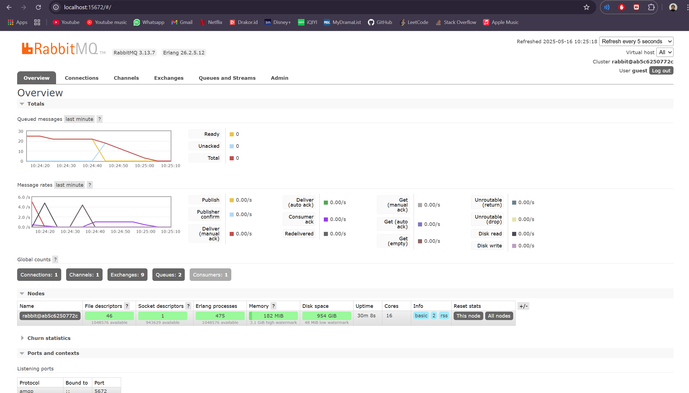
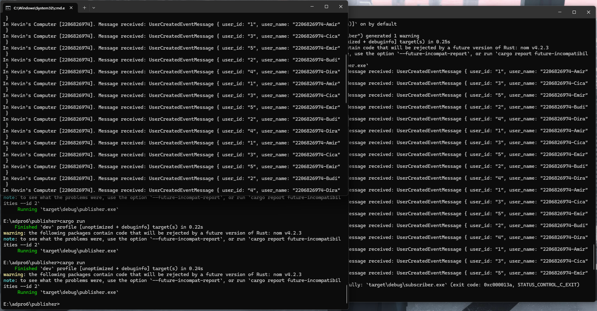
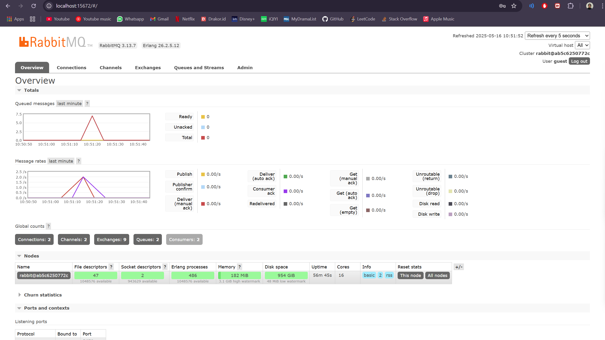

# TUTORIAL 9

### 1. What is amqp?
AMQP, atau Advanced Message Queuing Protocol, adalah protokol komunikasi jaringan yang digunakan untuk mengirim pesan antar aplikasi, organisasi, atau komponen yang berbeda. Protokol ini mendukung load balancing dan monitoring dalam pemrograman karena memisahkan proses exchange (yang dikirim oleh producer) dan queue (yang diterima oleh consumer).

Dalam file main.rs, AMQP digunakan sebagai sistem antrian pesan (message queuing) yang menghubungkan UserCreatedHandler dengan fungsi main melalui CrosstownBus. UserCreatedHandler berfungsi menerima pesan yang dikirim ke queue dengan topik "user_created".

### 2. What does it mean? guest:guest@localhost:5672 , what is the first guest, and what is the second guest, and what is localhost:5672 is for?
```guest:guest@localhost:5672``` merupakan URL yang digunakan untuk menghubungkan ke server AMQP.

Kata pertama guest menunjukkan username yang dipakai untuk otentikasi ke RabbitMQ, sedangkan guest kedua merupakan password-nya. localhost menandakan bahwa server AMQP dijalankan pada mesin lokal yang sama dengan aplikasi. Angka 5672 adalah port default yang digunakan oleh RabbitMQ untuk menerima koneksi dari client.

## Message Broker dengan RabbitMQ
### Simulating slow subscriber


Pada gambar tersebut, saya membuat subscriber bekerja lebih lambat dengan menambahkan delay 1 detik untuk setiap proses penerimaan data dari message broker. Akibatnya, jumlah pesan yang masuk ke antrean (queued messages) di message broker meningkat karena kecepatan publisher dalam mengirim pesan lebih tinggi dibandingkan kecepatan subscriber dalam memprosesnya.

### event-driven architecture



Saya melakukan hal yang serupa seperti pada bagian Simulation slow subscriber. Namun, kali ini saya menjalankan lebih dari satu subscriber. Hasilnya, proses pengiriman data menjadi jauh lebih cepat, dan dalam kasus ini, hanya terdapat satu antrean (queue) pada message broker. Hal ini disebabkan karena message broker akan membagi pesan yang diterima dari Publisher ke beberapa subscriber yang terhubung, meskipun semuanya terhubung ke satu queue yang sama. Tanpa perlu mengubah kode program, kita tetap bisa mendapatkan hasil yang berbeda hanya dengan menyesuaikan konfigurasi pada message broker atau jumlah subscriber yang dijalankan.